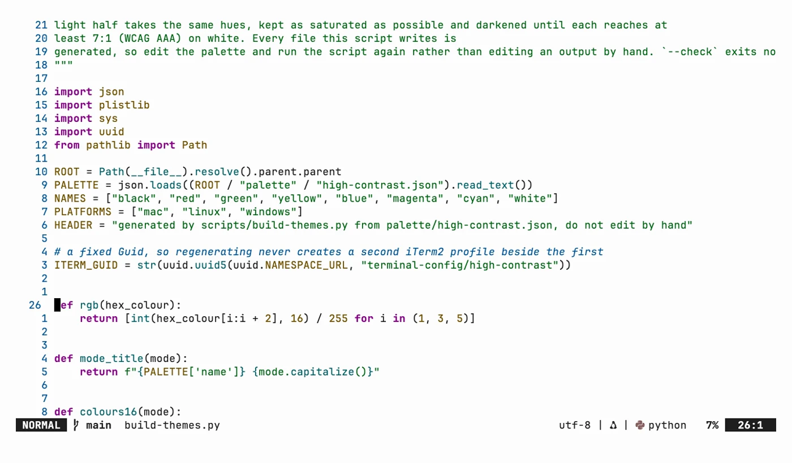

# neovim-config

> Neovim config in pure Lua: lazy.nvim, LSP through Mason, treesitter, Telescope, completion and
> a small set of vi-style keymaps.

## In action

Screenshots in the High Contrast palette, dark and light. Each one links to a short animation of the same scene.

### Neovim

| Dark | Light |
| --- | --- |
|  |  |

## What's here

- **[`nvim/`](nvim/)** - the full config. It is pure Lua with no OS-specific paths, so it is
  identical on every platform. `init.lua` loads core options and keymaps, then bootstraps
  `lazy.nvim`, which reads every file under `lua/plugins/`.
- **[`nvim/lazy-lock.json`](nvim/lazy-lock.json)** - the exact plugin commit each spec resolved
  to, so a fresh install gets the same versions rather than whatever is newest that day.

## Setup

Full walkthrough in [guides/setup.md](guides/setup.md): install Neovim, copy `nvim/` to your
config path, launch once to let `lazy.nvim` install everything.

## Structure

| Path | Contents |
| --- | --- |
| [`ACCESSIBILITY.md`](ACCESSIBILITY.md) | The high-contrast theme, readable layout and short key sequences |
| [`nvim/`](nvim/) | The config. Installs to `~/.config/nvim/` on macOS and Linux, `%LOCALAPPDATA%\nvim\` on Windows |
| [`guides/`](guides/) | Setup walkthrough and full reference |
